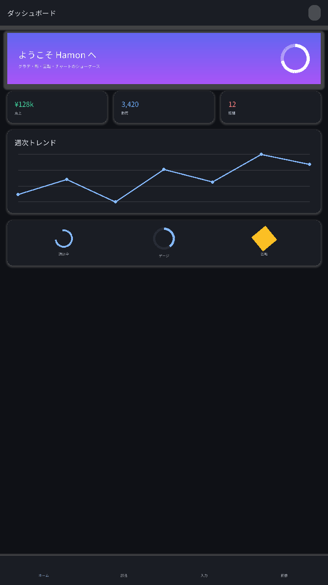
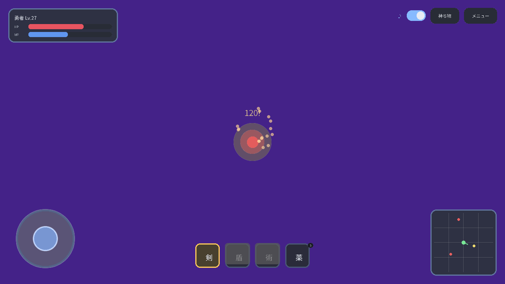

# Hamon

[日本語版](README.ja.md)

A reactive, declarative UI library for C#, especially for MonoGame. **UI = f(state)**.

Hamon lets you describe UI declaratively while following state changes and avoiding per-frame heap allocations in game hot paths. The core is independent of any rendering engine, and rendering backends can be replaced (a MonoGame backend is included).

## Features and design goals

- **Declarative retained UI**: three layers—Widget (immutable blueprint) → Element (retained instance) → Render.
- **Reactive updates**: rebuilds only the changed parts when state changes; steady-state rendering is allocation-free.
- **Flexbox subset** layout with absolute-position anchors.
- **First-class input support**: touch; mouse and keyboard; and gamepads with focus navigation (Focusable, D-pad navigation, OK/Cancel).
- **Text rendering**: FontStashSharp with dynamic TTF glyph atlases, including Japanese text support.
- **Rich drawing**: gradients, soft shadows (elevation), lines, circles, arcs, and rotation are available as `IPainter` primitives with default (DIM) implementations. Simpler backends degrade gracefully. SDF and shaders are intentionally not required to preserve KNI/Web compatibility.
- **High-level widgets**: Scaffold/AppBar/NavigationBar, Snackbar/Toast, Form/TextFormField with validators, DatePicker, Material/Card/GradientBox, and CircularProgressIndicator. Animations include easing functions, `CubicBezier`, `TweenSequence`, and Hero transitions.
- **Theming**: the default theme is *Hamon* (`HamonTheme.Default`), a clear, translucent, aqua-toned light palette. Dark mode is opt-in; set `HamonRoot.DarkTheme` to enable it.
- **Game embedding**: `SceneView` lets you treat the game world as a widget in the UI tree.
- **Minimal MonoGame host**: `HamonApp`/`HamonGame` wire up SpriteBatch, rendering, mouse/keyboard/gamepad/IME input, HiDPI, and background clearing. A Hamon-only app can be started with `new HamonGame(root).Run();`.
- **Portability**: the core is pure C# and rendering, text, and textures are abstracted through `IPainter`, `ITextRenderer`, and `ITexture`. The MonoGame backend supports DesktopGL and KNI (Web).

## Repository layout

```
Hamon.sln
src/Hamon/                   Core (Widget/Element/Layout/Input/Focus/SceneView)
src/Hamon.MonoGame/          MonoGame rendering backend
src/Hamon.Fonts/             FontStashSharp text backend
tests/Hamon.Tests/           Deterministic unit tests
tests/Hamon.Conformance/     KNI conformance build (build only)
docs/ime.md                  IME and text-input integration
samples/Hamon.MinimalApp/    Minimal app
samples/Hamon.Sandbox/       Feature demos and usage-pattern examples
samples/Hamon.SampleApp/      Catalog sample (calculator/stopwatch/weather/ToDo/gallery/settings)
samples/Hamon.SampleApp2/     Rich UI showcase
samples/Hamon.SampleApp3/     Game-style HUD showcase
```

## Getting started

The minimal app requires no wiring:

```csharp
using Hamon.MonoGame;

using var game = new HamonGame(new CounterApp()); // Pass the root Widget.
game.Run();                                       // Font/input/rendering/HiDPI are automatic.
```

To host Hamon inside an existing `Game`, create `new HamonApp(this, () => root)` in `LoadContent`, then call `_app.Update(gameTime)` and `_app.Draw(gameTime)` from `Update` and `Draw`. Options such as theme, font path, window size, fullscreen, VSync, and mouse visibility can be supplied with `HamonAppOptions`. Window options are nullable; unspecified values leave an existing game's settings untouched.

For usage patterns covering pure views, `StatelessWidget`, external models, `State<T>`, `Bind`, and `HookWidget`, see [`samples/Hamon.Sandbox/UsagePatterns.cs`](samples/Hamon.Sandbox/UsagePatterns.cs).

Run the sample applications with:

```shell
dotnet run --project samples/Hamon.SampleApp
dotnet run --project samples/Hamon.SampleApp2
dotnet run --project samples/Hamon.SampleApp3
```

`Hamon.SampleApp` contains calculator, stopwatch, weather, ToDo, gallery, and settings examples. `Hamon.SampleApp2` is a rich UI showcase. `Hamon.SampleApp3` demonstrates overlaying a game-style HUD on a game world with `HamonApp` and `ClearBackground = false`.




The samples are intended to teach Hamon usage. Headless checks for metrics and screenshots live in `Hamon.Sandbox` (for example, `HAMON_DUMP`) and `tests/Hamon.E2E.Tests`.

## Status

In development (pre-1.0). State management (`hooks`/`atom`) is optional, and Hamon can also be used as a stateless, pure-view library.

## License

Hamon is licensed under the [Mozilla Public License 2.0](LICENSE).

The bundled **Noto Sans JP** font is licensed under the SIL Open Font License 1.1. See [THIRD-PARTY-NOTICES.md](THIRD-PARTY-NOTICES.md) and [`assets/fonts/NotoSansJP/OFL.txt`](assets/fonts/NotoSansJP/OFL.txt).
